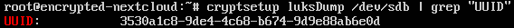

# Guide

## Create Server

### Add Volume


## Install own image

### Mount


### Open console and restart

### Choose language, country and keyboard layout


### Skip network config


### Setup encrypted lvm


### Rest of installation


At this point unmount the image in the cloud control panel and then hit enter in the terminal.

### Enter passphrase on boot


## Setup networking

 Edit `/etc/netplan/01-netcfg.yaml` and add the following part:

 ```yaml
network:
    version: 2
    renderer: networkd
    ethernets:
        ens3:
            addresses:
                - <ip6-address-copied-from-panel>::1/64
            dhcp4: true
            gateway6: fe80::1
```

After saving apply the netplan:

```bash
netplan apply
```

Now try to ping an ip outside of your box:

```bash
ping 1.1.1.1
```

## Encrypt volume and setup file system

Set volume as encrypted:

```bash
cryptsetup -y -v luksFormat /dev/sdb
```


Create random key for your volume and set proper permissions:

```bash
dd if=/dev/urandom of=/etc/volume-secret-key bs=512 count=8
chmod 0600 /etc/volume-secret-key
```


Add your key file to your volume as an ecryption key:

```bash
cryptsetup -v luksAddKey /dev/sdb /etc/volume-secret-key
```


To be able to automatically mount your encrypted volume you first need to get the UUID of your volume:

```bash
cryptsetup luksDump /dev/sdb | grep "UUID"
```



Now you need to edit `/etc/crypttab` and add the following entry for your volume:

    volume UUID=3530a1c8-9de4-4c68-b674-9d9e88ab6e0d /etc/volume-secret-key luks

After doing that you are already able to start the encrypted volume:

```bash
cryptdisks_start volume
```


Install `pv` to see progress on the next step when clearing the volume:

```bash
apt-get update && apt-get install pv
```

Then clear the volume (this might take a few minutes depending on the size of the volume):

```bash
pv -tpreb /dev/zero | dd of=/dev/mapper/volume bs=128M
```


Now you can create the file system on top of the encrypted volume:

```bash
mkfs.ext4 /dev/mapper/volume
```


After that create a mount folder for the volume ...:

```bash
mkdir /mnt/volume
```

...and add the following line to `/etc/fstab`:

    /dev/mapper/volume  /mnt/volume ext4    defaults    0   2


Now mount the encrypted volume with a swift:

```bash
mount -a
```

## Installing Nextcloud

Install nextcloud and enable removable media:

```bash
snap install nextcloud
snap enable nextcloud
snap connect nextcloud:removable-media
```

Create a new data folder on your volume:

```bash
mkdir /mnt/volume/nextcloud
```

Update the config for nextcloud to use that new folder:

```bash
    nano /var/snap/nextcloud/current/nextcloud/config/config.php
```


Disable nextcloud, move over all files, if there are already any and enable it again:

```bash
snap disable nextcloud
mv /var/snap/nextcloud/common/nextcloud/data/* /mnt/volume/nextcloud
snap enable nextcloud
```

For further configuration visit <https://manandkeyboard.tk/2018/01/07/nextcloud-snap-installation/>

After that you can open up your browser and navigate to your server's ip:


